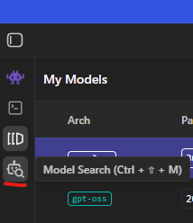
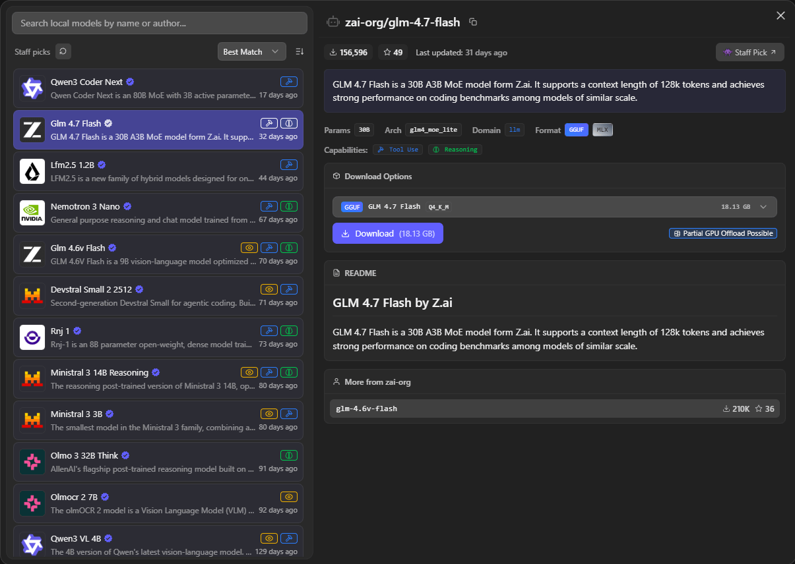
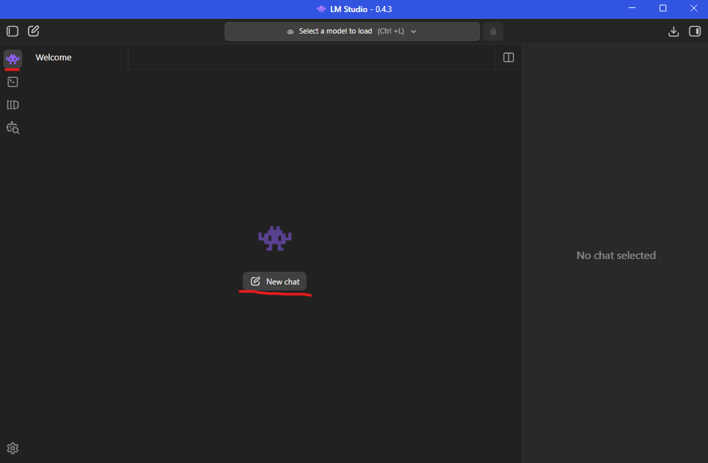
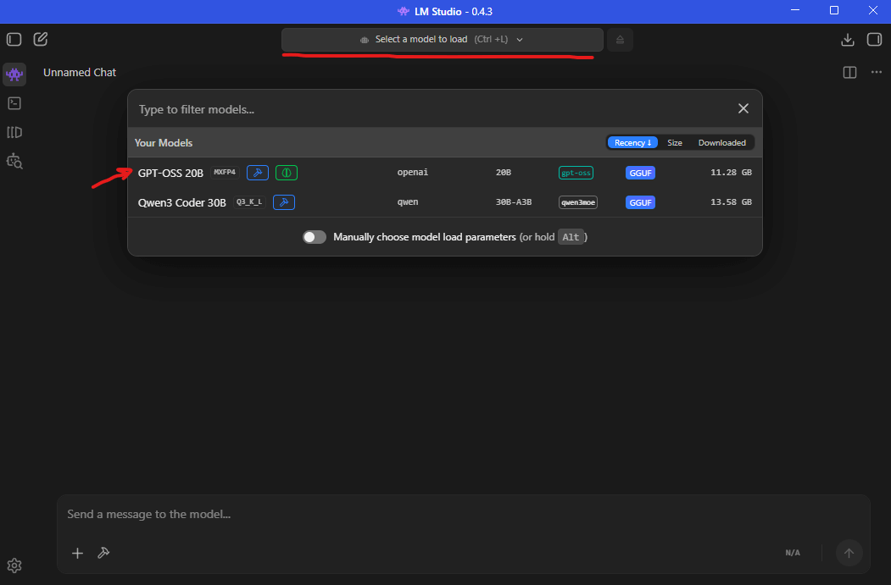
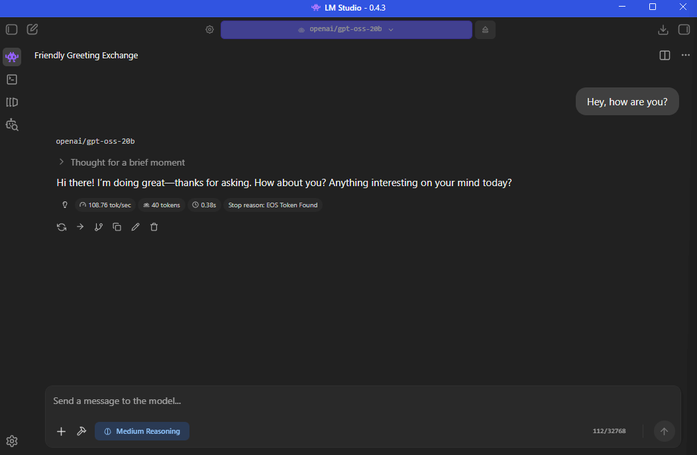
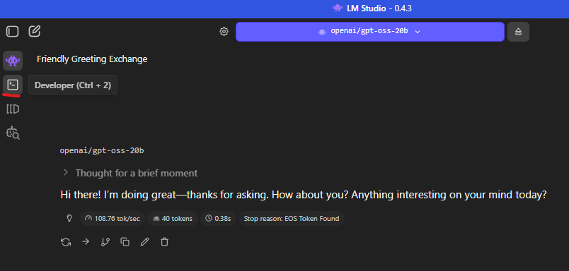
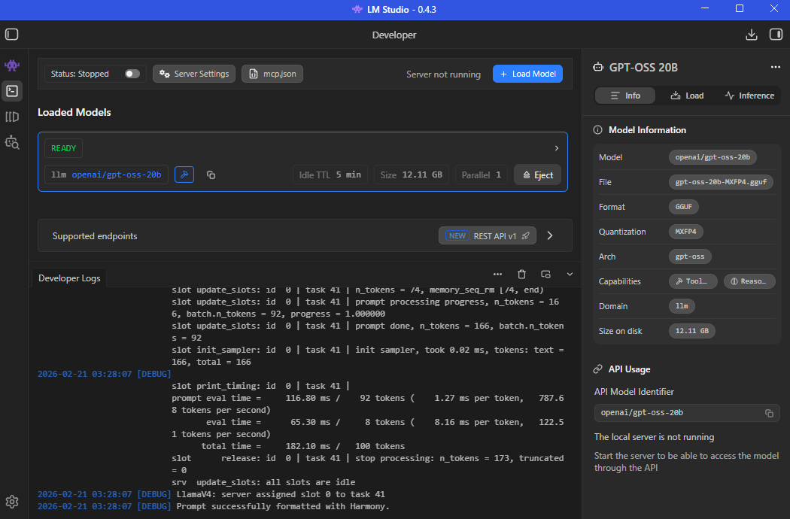
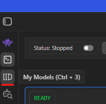
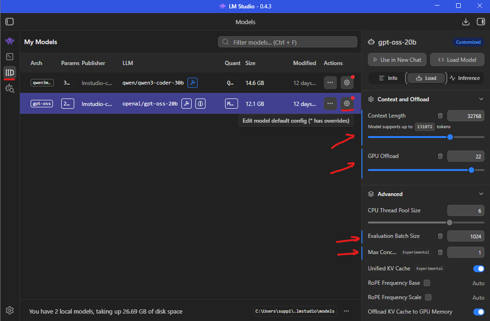

# Choosing LLM

> Assumes Git, Python, npm, and [LM Studio][1] are installed. If not, install them. (Yes, all of them. We're being
> practical.)

## Overview

There are many models. There will be more next week. Each will be marginally better than the previous one, and the
internet will briefly declare it revolutionary.

> SOTA = State of the Art (for now)

We take a calmer approach: define what you actually need. Model selection is an engineering decision, not a reaction to
a leaderboard fluctuation.

Broadly, LLM capabilities fall into three categories:

| Capability | Why                                                                                          |
|------------|----------------------------------------------------------------------------------------------|
| Tool use   | When the model must interact with external systems instead of just producing confident text. |
| Thinking   | When multi-step reasoning matters more than token throughput.                                |
| Vision     | When pixels are involved and pretending otherwise won't help.                                |

Pick for your use case, not for the hype cycle. You are optimizing for outcomes, not for a badge.

> For my use cases based on my hardware configuration, I am using two following models:
> - [Qwen3 Coder 30B A3B Instruct Q3_K_L][2] for coding and tool use (e.g., file reading, coding).
> - [GPT OSS 20B][3] for reasoning, exploration, and tool use (e.g., web search).

Fortunately, LM Studio provides a marketplace-style interface for model discovery. It filters models by your hardware
constraints, supports fine-grained filtering, and answers the essential question: _will this actually run on my
machine?_

Here's where to find it in the UI:

And the interface itself:

Once you find a suitable model, click **Download**.

---

## LM Studio Settings

Click the cog wheel in the bottom-left corner to open settings.

Key options:

- `Developer`:
    - `Developer Mode`: Set to `ON`. More visibility rarely hurts.
    - `On-Demand Loading and Model TTL`:
        - `JIT models auto-evict` and `Max idle TTL`: Personal preference. `ON` with `5` minutes works well for me.
    - `Enable Local LLM Service`: Set to `ON` so closing the UI does not terminate the service.
- `Model Defaults`:
    - Review `Model Loading Guardrails`. They exist to prevent enthusiastic configuration from overwhelming your
      hardware.

---

## First launch and interaction test

LM Studio includes embedded chat. Use it to confirm the model works before integrating it into a larger system with
three agent frameworks.

Click **New Chat**:

Then **Load Model** and select your downloaded model:

Finally, type something:

If you receive a response, the model is operational. This is a good baseline.

---

## What happened under the hood?

With Developer Mode enabled, open the developer view:

You now have:

- Control over the LM server and its settings.
- A list of loaded models, with manual unload options.
- A full interaction log.
- Model metadata and tuning parameters.

> Note: Changes made in Developer view are not persisted. To make them permanent, go to **My Models**, click the cog
> wheel, and [save your adjustments][4]. The arrows in the screenshot highlight the parameters I modified.

---

## Navigation

[⬅ Beginning](../01_beginning/README.md) | [🏠 Home](../README.md) | [LLM Settings ➡](../03_llm_settings/README.md)

[1]: https://lmstudio.ai/

[2]: https://lmstudio.ai/models/qwen/qwen3-coder-30b

[3]: https://lmstudio.ai/models/openai/gpt-oss-20b

[4]: https://lmstudio.ai/docs/app/advanced/per-model