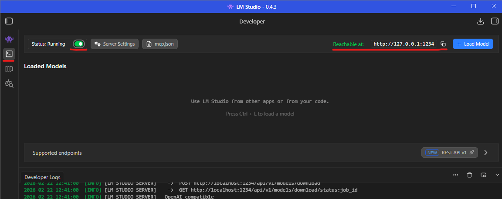

# LLM Settings

> Git, Python, npm, LM Studio — presumably already installed. We'll assume competence.

## Goal

Once your LLM is running and pointed at something useful, you will eventually try to make it slightly better. That is
when this page becomes relevant. Until then, this document can wait.

If you are a developer, installing a CLI tool for coding assistance is the predictable next step. See
the [Coding Agent](../04_coding_agent/README.md) page.

Tuning requires understanding your effective context window and hardware constraints. If those terms are still vague,
defer this page.

Premature optimization continues to be a reliable way to waste effort. Add a real workload first – then optimize. Not
the other way around.

---

## TL;DR

Match settings to hardware and latency tolerance.

The goal is not maximal cleverness. It is stable, predictable behavior.

### Settings worth looking at

LM Studio defaults are generally reasonable. You do not need to outsmart them on day one.

- **Context Length**: must cover your use case. Larger context = more memory usage and larger **KV Cache**.
- **GPU Offload**: more layers on GPU = faster compute, less CPU pain. But VRAM is finite; offloading more reduces space
  for **KV Cache**. You can partially compensate via **K/V Cache Quantization Type**.
- **Evaluation Batch Size**: empirical. Leave default unless latency is unacceptable.
- **Max Concurrent Predictions**: set to `1` unless you are intentionally running multiple chats or tool-heavy
  workflows.
- **K/V Cache Quantization Type**: lower precision reduces memory usage. May slightly degrade recall, coherence, or
  reasoning.

### Automation helps

Included: a Bash script used for local benchmarking.

Goal:

> Given context window sizes and GPU offload values, test combinations to identify which yields higher
> Tokens-per-Second (TPS) throughput by sending `N` varied payloads in random order. Alternatively, fix context and
> offload values to evaluate other parameters not exposed via LM Studio CLI.

It is not a research framework. It is a pragmatic way to justify GPU settings without inventing an agent-based
benchmarking pipeline.

Usage:

- You will need to enable LM Studio server (note that the server endpoint is also displayed):



- You will need to fetch your model name:


- For a quick local run on a non-Windows machine:

```bash
./03_llm_settings/llm_load_benchmark.sh -m qwen/qwen3-coder-30b
```

- For Windows WSL2:

```bash
./03_llm_settings/llm_load_benchmark.sh -m qwen/qwen3-coder-30b --lms-path /mnt/c/Users/<YourWindowsUser>/lmstudio/bin/lms.exe
```

`--help` provides full options.

---

## Vocabulary + Recap

Before adjusting anything, it helps to understand what these systems actually are. Not magic. Just layered linear
algebra with good PR.

The goal is not to turn you into an LLM researcher. Just enough clarity so you know which switch makes it faster,
slower, or unexpectedly creative.

| Term                               | Brief definition                                                                                                                                                                  |
|------------------------------------|-----------------------------------------------------------------------------------------------------------------------------------------------------------------------------------|
| Token                              | Smallest unit of text processed by the model (word or subword). Example: "unbelievable" → `un`, `believ`, `able`.                                                                 |
| Tensor                             | Multidimensional array of numbers used inside a **Neural Network**. The thing GPUs are very good at.                                                                              |
| Embedding                          | Mapping from a discrete **Token** to a dense **Tensor** so math can happen.                                                                                                       |
| Neural Network                     | Parameterized function composed of stacked **Neural Network Layers** transforming numbers into other numbers.                                                                     |
| Neural Network Layer               | A parameterized transformation (often linear + bias) plus optional nonlinearity, **Normalization**, or **Attention**.                                                             |
| Activation                         | Intermediate numerical output after a **Neural Network Layer**.                                                                                                                   |
| Normalization                      | Rescales **Activations** to controlled statistics (mean ≈ 0, variance ≈ 1). Prevents numerical chaos.                                                                             |
| Model Weights                      | Learned numerical parameters encoding statistical patterns from training data. Large file. Very large file.                                                                       |
| Attention                          | Mechanism where each **Token** weighs the influence of other **Tokens**. Example: in "The cat sat because it was tired," "it" strongly attends to "cat."                          |
| Self-Attention                     | **Attention** computed within the same input **Token** sequence.                                                                                                                  |
| Feed-Forward Network (FFN)         | Small **Neural Network** inside a **Transformer Layer**, applied independently per **Token**.                                                                                     |
| Transformer Layer                  | Repeated block: **Self-Attention** + **Feed-Forward Network** + **Normalization** + residuals. Projects hidden states into **Query** (Q), **Key** (K), **Value** (V) **Tensors**. |
| Rotary Positional Embedding (RoPE) | Encodes position by rotating **Query** and **Key** **Tensors** in **Self-Attention** based on **Token** index. Geometry, but polite.                                              |
| Transformer                        | Architecture built from stacked **Transformer Layers** using parallel **Self-Attention**.                                                                                         |
| Large Language Model (LLM)         | Large **Transformer** modeling next-**Token** probabilities. Given "2 + 2 =", it strongly prefers "4." Usually.                                                                   |
| Context (in LLM)                   | Sequence of **Tokens** currently visible to the **LLM** when computing next-token probabilities.                                                                                  |
| Inference                          | Forward pass of the trained **LLM** to generate next **Token(s)**.                                                                                                                |
| Prediction                         | Output of **Inference**: next-token probabilities or sampled **Token**.                                                                                                           |
| KV Cache                           | Stored **Key**/**Value** **Tensors** reused across generation steps to avoid recomputing **Attention**. Saves time. Costs memory.                                                 |
| Quantization                       | Reducing numerical precision of **Model Weights** or **Activations** to save memory and increase speed.                                                                           |
| Expert (in LLM)                    | One of multiple parallel **FFNs** in a Mixture-of-Experts **LLM**; routing selects which **Experts** process a **Token**. Controlled specialization.                              |

> That was a lot.  
> We will now use these terms sparingly and translate them, when necessary, into:  
> "faster," "slower," or "uses your entire GPU."

---

## LM Studio Settings

### Load

These settings affect how the model is loaded and staged.

#### Context and Offload

| Setting        | Purpose                                                                                                     |
|----------------|-------------------------------------------------------------------------------------------------------------|
| Context Length | Maximum number of **Tokens** remembered at once. Larger = more memory, more **KV Cache**, longer coherence. |
| GPU Offload    | Number of **LLM layers** moved from CPU to GPU. More GPU = faster math, less CPU suffering.                 |

#### Advanced

| Setting                                                | Purpose                                                                                                                                           |
|--------------------------------------------------------|---------------------------------------------------------------------------------------------------------------------------------------------------|
| CPU Thread Pool Size                                   | Threads preallocated for initialization: reading **LLM** file, dequantizing, allocating **Tensors**.                                              |
| Evaluation Batch Size                                  | Number of **Tokens** processed at once. Larger = more memory, fewer passes; smaller = slower but lighter.                                         |
| Max Concurrent Predictions                             | How many replies the **LLM** can generate simultaneously. For a home setup, `1` is realistic.                                                     |
| Unified KV Cache                                       | Reuses memory for **Predictions**. Leave it on unless you enjoy inefficiency.                                                                     |
| RoPE Frequency Base                                    | Controls positional angle scaling. Higher = better long-context extrapolation; lower = sharper local distinction. Change carefully.               |
| RoPE Frequency Scale                                   | Additional scaling factor for RoPE. Also change carefully.                                                                                        |
| Offload KV Cache to GPU memory                         | Store **KV Cache** in VRAM instead of RAM. Prefer ON if GPU memory allows.                                                                        |
| Try mmap()                                             | Uses OS `mmap()` to lazily load weights from disk. ON if disk is fast; otherwise, patience required.                                              |
| Seed                                                   | Controls determinism. Fixed seed = reproducible randomness.                                                                                       |
| Number of Experts                                      | Active **Experts** in Mixture-of-Experts **LLM**s. No effect if model does not support Mixture-of-Experts.                                        |
| Number of layers for which to force Mixture-of-Experts | Forces Mixture-of-Experts routing in selected layers. Experimental. Interpret results cautiously.                                                 |
| Flash Attention                                        | Memory-optimized **Attention** algorithm. Computes only necessary **Tensors**. Turn it ON.                                                        |
| K/V Cache Quantization Type                            | Precision used to store **KV Cache** during **Inference**. F32 = heavy but precise. Q4_0 = compact, slightly more compute. Trade-offs, as always. |

### Inference

These settings affect generation behavior.

#### System Prompt

Hidden instruction prepended before user input. Defines a role, tone, constraints.

Consumes **Context**. As with YAML, every additional line feels harmless until it isn't.

#### Settings

| Setting               | Purpose                                                                                                                    |
|-----------------------|----------------------------------------------------------------------------------------------------------------------------|
| Temperature           | Controls randomness of **Token** sampling. Lower = deterministic. Higher = exploratory. Extremely high = creative entropy. |
| Limit Response Length | Caps response in **Tokens**. Lower = shorter replies, lower latency, smaller **KV Cache**.                                 |
| Context Overflow      | Defines behavior when total **Tokens** exceed maximum **Context** length. Decide which memory gets sacrificed.             |
| Stop Strings          | Stops generation when specified sequence appears. Cooperative termination mechanism.                                       |
| CPU Threads           | Threads allocated for **Inference** execution. More threads can help; beyond a point, they do not.                         |

#### Reasoning Parsing

Separates structured reasoning blocks (e.g., `<think>...</think>`) from final answers.

Useful if you care about structured outputs. Or auditing what the model almost said.

#### Sampling

| Setting        | Purpose                                                                                                                     |
|----------------|-----------------------------------------------------------------------------------------------------------------------------|
| Top K Sampling | Restricts next-**Token** choice to top `K` most probable **Tokens**. Lower = more deterministic; higher = broader sampling. |
| Repeat Penalty | Reduces probability of previously generated **Tokens**. `1` = no penalty; too high = linguistic instability.                |
| Top P Sampling | Selects smallest set of **Tokens** whose cumulative probability ≥ `P`. Adaptive alternative to Top K.                       |
| Min P Sampling | Keeps **Tokens** whose probability exceeds a fraction of the highest probability. Lower = diversity; higher = determinism.  |

#### Structured Output

Forces output to match a predefined schema (typically JSON).

Highly recommended if another system — or your future self — needs to parse it. Less recommended if you enjoy debugging
malformed braces.

#### [Speculative Decoding][1]

Advanced feature. Experiment at your discretion. Measure before declaring victory.

---

## Navigation

[⬅ Choosing LLM](../02_choosing_llm/README.md) | [🏠 Home](../README.md) | [Coding Agent ➡](../04_coding_agent/README.md)

[1]: https://lmstudio.ai/docs/app/advanced/speculative-decoding
