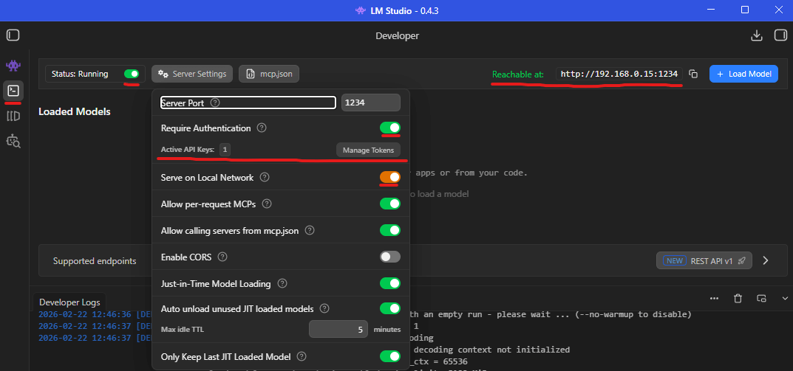
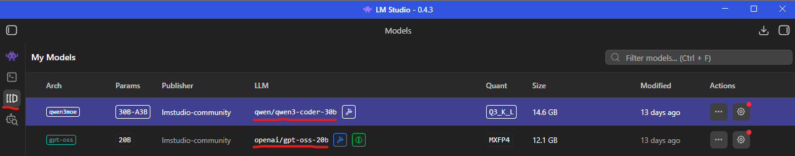
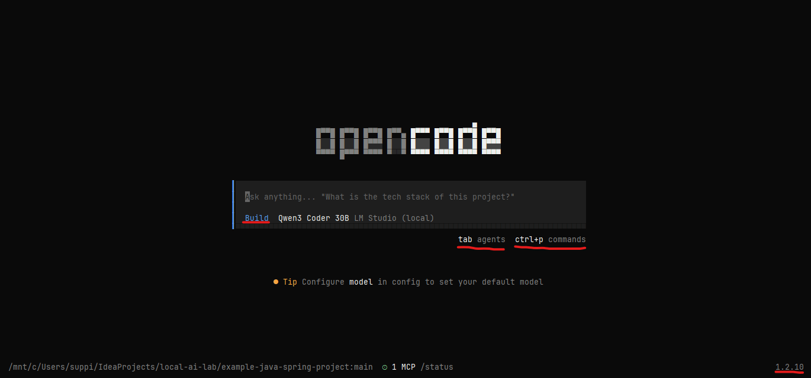
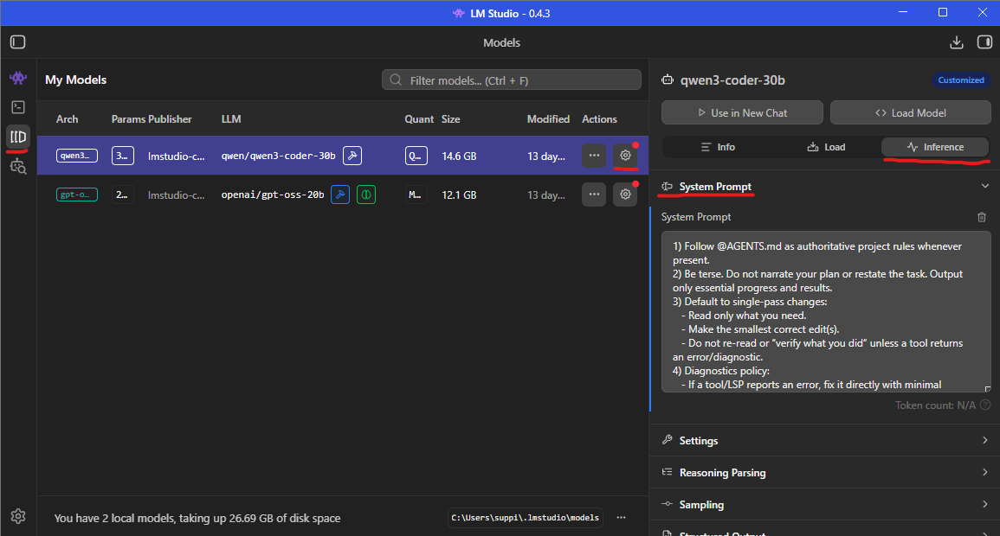

# Coding Agent

> Git, Python, npm, LM Studio — presumably already installed. This is your last reminder.

## Goal

Make coding tasks go brrr with [OpenCode][1].

---

## Installation

No plot twists here. Go to the official documentation and follow the [installation guide][2].

Do **not** follow the *Configure* step yet — it assumes you will connect to external LLMs, which would politely undo the
entire point of installing LM Studio locally.

After installation, go to your project directory. For the first run, create a small sample project so you can observe
what OpenCode actually does before pointing it at something you care about.

Since I am a Java developer, I will use a simple [example-java-spring-project](../example-java-spring-project) as a
sandbox. If you checked out the repository and want to follow along,
use [fresh-java-spring-project](../fresh-java-spring-project), which is intentionally untouched — a control group for
your experiments.

---

## Configuration

OpenCode uses a [tiered configuration structure][3], which means configuration can live directly inside your project.
Sensible, practical, and just enough flexibility to overengineer if you try hard enough.

For documentation purposes, I define configuration locally. However, authentication keys in project-level config are
**NOT SECURE** and not appropriate for production use.

In my Windows + WSL2 setup, I have to expose LM Studio to the local network, so enabling LM Studio authentication makes
sense. Since this environment is entirely local and controlled, I am comfortable exposing the example auth key here.

- 🟢 Do **treat credentials like credentials**. Verify connectivity, then move authentication keys to global config (
  `~/.config/opencode/opencode.jsonc`).
- 🔴 **Don't commit credentials to version control or share them publicly**. This should not need to be said, yet here we
  are.

The relevant official documentation section is [here][4].

- My LM Studio server settings (authentication enabled, token created via `Manage Tokens`, and `Serve on Local Network`
  turned on):



- My OpenCode project configuration:

> Note: JSONC is a superset of JSON that allows comments and is [supported by OpenCode][5]. Because sometimes comments
> are cheaper than documentation.

```json
{
  "$schema": "https://opencode.ai/config.json",
  "provider": {
    "lmstudio": {
      "npm": "@ai-sdk/openai-compatible",
      "name": "LM Studio (local)",
      "options": {
        "baseURL": "http://192.168.0.15:1234/v1",
        "apiKey": "sk-lm-90MpVcaA:nHGq1YH4MNGKEzyABCOB" // Do not commit this to your version control!
      }
    }
  },
  // Advanced configuration allows overriding which LLM is used for each agent.
  "agent": {
    "build": {
      "model": "lmstudio/qwen/qwen3-coder-30b" // Change to your LLM of choice!
    },
    "plan": {
      "model": "lmstudio/qwen/qwen3-coder-30b" // Change to your LLM of choice!
    }
  }
}
```

> **Reminder**: `model` is `lmstudio/` plus the model name shown here:



If you feel the urge to assign different models to every agent "just in case," pause. Measure first.

---

## Initialize

Open a terminal in your project directory (or `cd ./fresh-java-spring-project` if following along) and run:

```shell
opencode
```

You should see a UI similar to this:



- `Build` indicates the selected agent. Cycle through agents with <kbd>Tab</kbd>:
    - Built-in agents are documented [here][6].
- <kbd>Ctrl</kbd> + <kbd>P</kbd> opens the command palette. Explore cautiously.
- The current OpenCode version is shown in the bottom-right corner. Useful when debugging issues caused by yesterday's
  update.

---

Now follow the [official instructions][7]. With the OpenCode interface open, type:

```
/init
```

If everything is configured correctly, you should eventually see a
new [AGENTS.md](../example-java-spring-project/AGENTS.md) file in your project directory. Unlike your experimental
config tweaks, this file should be committed to version control.

> If things do not work, consult the [troubleshooting guide][8]. Failing that, search engines and their AI modes remain
> surprisingly competent at debugging error messages.

---

## Chatty LLM

You may notice a generous amount of terminal output while processing `/init`. This is normal.

If you prefer something more concise, configure a system prompt.

- In LM Studio, go to model settings → `Inference` → `System prompts`:



- Add there the following text:

> I am not a prompt engineering expert. If you see reasonable improvements, please suggest them.

```text
1) Follow @AGENTS.md or @CLAUDE.md as authoritative project rules whenever present.
2) Be terse. Do not narrate your plan or restate the task. Output only essential progress and results.
3) Default to single-pass changes:
    - Read only what you need.
    - Make the smallest correct edit(s).
    - Do not re-read or "verify what you did" unless a tool returns an error/diagnostic.
4) Diagnostics policy:
    - If a tool/LSP reports an error, fix it directly with minimal commentary.
    - After a fix, re-check only if there is still an error, or you changed multiple files.
5) Tool usage:
    - Do not use destructive commands (rm/mv) unless explicitly requested.
6) Output policy:
    - When asked to create/modify a file, ensure the final file content is correct, but do not print the full file unless the user asks.
    - When you need user input, ask exactly one short question.
```

- Ask the model a few more questions. You should observe fewer paragraphs and more signal.

---

## Navigation

[⬅ LLM Settings](../03_llm_settings/README.md) | [🏠 Home](../README.md) | [MCP ➡](../05_mcp/README.md)

[1]: https://opencode.ai/

[2]: https://opencode.ai/docs#install

[3]: https://opencode.ai/docs/config/#precedence-order

[4]: https://opencode.ai/docs/providers#lm-studio

[5]: https://opencode.ai/docs/config/#format

[6]: https://opencode.ai/docs/agents/#built-in

[7]: https://opencode.ai/docs/#initialize

[8]: https://opencode.ai/docs/troubleshooting/