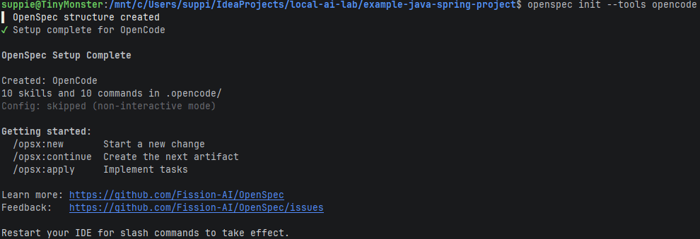
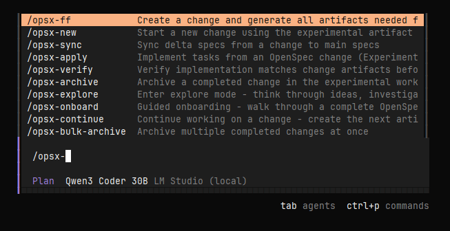
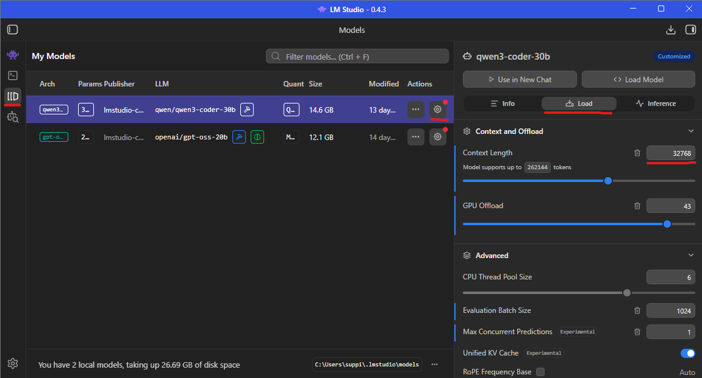
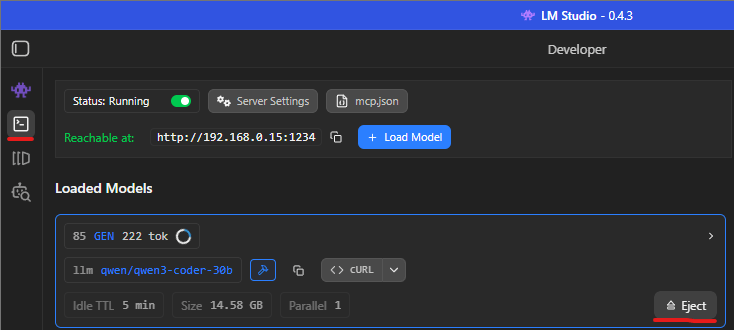

# Spec Driven Development

> Bring structure to coding agent work

## What is it?

In a nutshell: write the specification first, code later.

This _Yet Another Option Driven Development_ approach exists to avoid prompts like _"Build a better TikTok, make no
mistakes"_ and then acting surprised when the model inevitably does make a mistake. Instead, define and refine a
specification first. Then generate code against it.

The pleasant side effect: the specs are human-readable, which means they can be reviewed and corrected.

---

## Tools

I use [OpenSpec][1] for spec-driven development. It is opinionated and reasonably ergonomic. The website contains
everything needed to get started.

> There is also [SpecKit][2] from GitHub. In my experience it is more verbose, more rigid, and it always creates a new
> branch for development automatically (including when you did not ask). If that matches your workflow, great. If it
> doesn't, you will at least get very consistent branches.

> Note: the Bash script to benchmark LLMs was created and iteratively refined using OpenSpec. Yes, the tool was used to
> improve the toolchain used to evaluate tools. This is how the stack slowly justifies its own existence.

## Trying it out

We will use OpenSpec to add a small feature to our backend: an endpoint that returns `"Hello, World!"`. Not exactly
frontier AI, but useful for demonstrating the workflow.

### Goals

- Use OpenCode meaningfully.
- Use OpenSpec meaningfully.
- Determine whether our LLM Context Window needs adjustment (it usually does).

### Process

- Install OpenSpec

```shell
npm install -g @fission-ai/openspec@latest
```

- Initialize OpenSpec

```shell
openspec init --tools opencode
```



- Open OpenCode, switch to the `Plan` Agent, and run `/opsx-new`. This exposes additional commands:



> If you encounter "Cannot truncate prompt with n_keep (14109) >= n_ctx (4096)" (or similar), this is not a
> philosophical statement. It means your Context Window is too small.
>
> Increase the LLM Context Window in LM Studio. A practical approach is to use a power-of-two value comfortably larger
> than n_keep but not marginally so. In the example above, `32768` is a safer choice than `16384`, which risks overflow
> as the prompt expands and the model forgets earlier instructions.



> Remember to eject the model so it reloads with the updated parameters.



- When prompted, enter:

```text
Let's add a new endpoint that will return "Hello, World!"
```

- Inspect the generated files in the `openspec` directory.
- Progress through the steps with `/opsx-continue`.
- Once planning is complete, switch to the `Build` agent and run `/opsx-apply` to apply changes to the codebase.
- Review the changes, then run `/opsx-archive` to archive the implemented spec.

> The `example-java-spring-project` folder intentionally includes the raw output I received. The generated Spring test
> for the endpoint does not compile. This is not a failure of the methodology; it is a reminder that LLMs generate code,
> not guarantees.

---

## Outcome

What did we learn?

- Spec Driven Development introduces structure and reduces prompt-driven improvisation.
- OpenSpec provides a practical workflow for spec-first iteration.
- LLMs can generate useful code, but output quality remains probabilistic.
- Local LLM configuration (e.g., Context Window size) directly affects results and must be tuned deliberately.

I recommend revisiting the [LLM Settings](../03_llm_settings/README.md) page to refine parameters for your environment.

The next chapter moves back to the smallest unit in the stack: the prompt itself.

---

## Navigation

[⬅ MCP](../05_mcp/README.md) | [🏠 Home](../README.md) | [Prompt Engineering ➡](../07_prompt_engineering/README.md)

[1]: https://openspec.dev

[2]: https://github.github.com/spec-kit/
