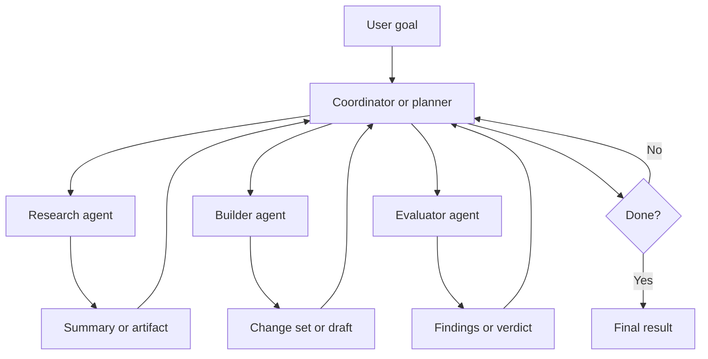
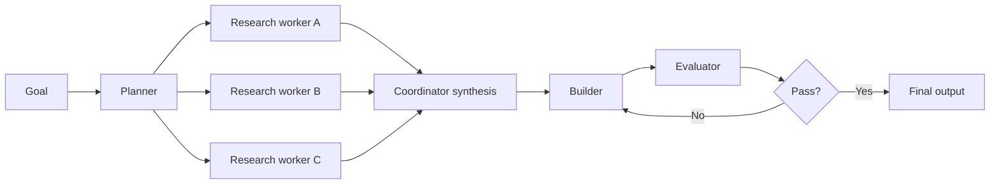
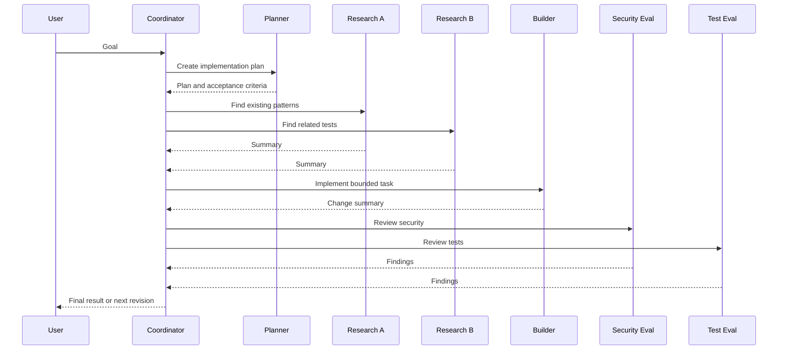

# Multi-Agent Workflow

> When one agent is not wrong, just overloaded.

Using multiple agents simultaneously is usually less about chasing some grand theory of digital management and more
about separating concerns that should not live in one context window at the same time.

The practical idea is simple:

- one agent coordinates
- several agents work on bounded pieces
- results come back as summaries, artifacts, or verdicts
- the coordinator decides what happens next [1][2][3][4][5][6]

That can improve speed, focus, and sometimes quality. It can also create a distributed system with opinions. So the
question is not whether multi-agent workflows are possible. They clearly are. The question is whether they are justified
for the task in front of you.

---

## What It Is

A multi-agent workflow is an orchestration pattern where several model runs work on the same overall goal, either in
parallel or in staged handoffs.

Bad:

- One agent plans the work, explores the repo, runs tests, reviews its own changes, writes the final answer, and keeps
  all of that intermediate noise in one thread.

Good:

- One coordinating agent keeps the goal and decisions, while separate agents handle exploration, implementation,
  evaluation, or review and return condensed outputs.

Anthropic frames this as a set of patterns such as prompt chaining, routing, parallelization, orchestrator-workers, and
evaluator-optimizer [1]. OpenAI's orchestration guidance makes a similar distinction between code-led orchestration,
manager-style specialist usage, and handoffs between agents [4][5].

The common idea underneath all of them is the same: separate the work so each agent has a narrower job than the original
problem.

---

## When Multiple Agents Actually Help

Use multiple agents when at least one of these is true:

- the work splits into independent subtasks
- different parts need different prompts or evaluation criteria
- the main agent would otherwise accumulate too much noisy intermediate output
- you need separate perspectives, such as implementation plus review
- you want to trade more tokens for better throughput or confidence [1][2][4][6]

Do not use them just because a single-agent workflow feels insufficiently futuristic.

Bad fit:

- one small deterministic edit
- a fixed pipeline that ordinary code can already express clearly
- a write-heavy task where five agents would collide in the same files
- a workflow where no one has decided how results should be merged

OpenAI's Codex documentation is blunt on one useful point: parallel agents are a good starting point for read-heavy
tasks such as exploration, tests, triage, and summarization, but parallel write-heavy workflows create conflicts and
coordination overhead [6]. That is a useful correction to the instinct to parallelize everything that moves.

---

## The Core Shape

At the highest level, a practical multi-agent workflow looks like this.

The coordinator keeps the scarce context:

- the real goal
- the important constraints
- the decision log
- the final synthesis

Workers do the noisy parts:

- search
- triage
- implementation
- testing
- review

This is not mystical. It is context hygiene with more process.

---

## Common Role Splits

There is no universal canonical org chart for agents, despite what some diagrams would like you to believe. But a few
role splits appear repeatedly in vendor guidance and practical systems [1][2][3][4][6].

### 1. Planner -> Builder -> Evaluator

This is the cleanest pattern for long-running work.

- planner expands a vague goal into a concrete plan
- builder executes the current step
- evaluator checks whether the result actually meets the bar

Anthropic's long-running harness article uses exactly this planner, generator, evaluator split for application-building
work [2].

### 2. Orchestrator -> Workers

This works when you do not know the required subtasks in advance.

- orchestrator decomposes the problem dynamically
- workers handle bounded subtasks
- orchestrator merges the outputs [1]

This is better for open-ended coding, search, or repo-wide analysis than a rigid fixed sequence.

### 3. Parallel Review or Voting

This works when you want several views of the same artifact.

- one agent reviews for security
- one reviews for maintainability
- one reviews for tests
- the coordinator merges the findings [1][3][6]

This is useful because agents are inconsistent in exactly the way parallel perspectives can sometimes help.

### 4. Research -> Synthesis

This is the simplest simultaneous workflow.

- several agents gather facts from different sources or files
- one agent combines them into a final answer

It is often the best place to start because it is mostly read-heavy and easier to reason about.

---

## Parallel vs Sequential

Not all multi-agent workflows should run at the same time.

### Parallel

Use parallel execution when the tasks are independent.

Examples:

- scan three parts of a repo
- run review passes with different criteria
- summarize several documents
- test several user journeys independently [1][4][6]

### Sequential

Use sequential execution when one output must shape the next step.

Examples:

- plan -> implement -> review
- research -> outline -> draft -> critique
- evaluate -> revise until threshold passes [1][2][4]

### Mixed

This is usually the practical answer.

That structure keeps parallelism where it helps and sequence where it is required.

---

## Artifacts Matter More Than People Want

Multi-agent workflows fall apart when agents pass each other vibes instead of state.

Good handoff artifacts are small, explicit, and boring. That is a compliment.

Useful artifacts include:

- a one-paragraph plan
- a task list with acceptance criteria
- a structured review result
- a list of changed files
- a short summary of what was tried and what failed
- a next-step recommendation [2][5]

OpenAI's handoff guidance distinguishes between preserving conversation context and explicitly controlling what metadata
and history the next agent receives [5]. That is an important distinction. A handoff is not a miracle. It still needs
controlled inputs.

Bad:

- "Ask the next agent to continue from here."

Good:

- "Here is the goal, current status, files touched, failing check, and one open question."

The less implicit state you require, the more repeatable the workflow becomes.

---

## Model Selection by Role

This is where people often waste either money or accuracy.

Different roles want different tradeoffs.

OpenAI's reasoning guidance is explicit: reasoning models are good planners and decision-makers, while faster GPT-style
models are better workhorses for well-defined execution [3]. Anthropic gives a similar routing recommendation: cheaper
models for easy/common work, stronger models for harder or more ambiguous tasks [1].

That leads to a practical split like this:

| Role | What it does | Model tendency |
|---|---|---|
| Planner | decomposes the goal, chooses steps, resolves ambiguity | stronger reasoning model |
| Research worker | gathers facts, summarizes sources, scans files | faster cheaper model if task is read-heavy |
| Builder | performs bounded implementation work | strong coding model, often not the most expensive planner model |
| Evaluator | checks quality, edge cases, or policy compliance | stronger skeptical model, often with higher reasoning effort |
| Final synthesizer | merges outputs into one answer | stronger general-purpose model |

The planner and evaluator often deserve the strongest models because they are making judgment calls rather than just
executing explicit instructions.

The builder does not always need the absolute strongest planner model. If the task is well-bounded, a cheaper coding
model may be perfectly adequate.

The research workers are often the easiest place to save money.

---

## A Practical Model Mix

If you are designing a multi-agent workflow today, a sensible starting point is:

- strongest reasoning model for planning
- fast coding or general model for bounded execution
- stronger model again for evaluation on risky or ambiguous tasks
- smaller or cheaper models for parallel summarization and triage [1][3][6]

Bad:

- Use the same expensive model for every role because it feels safer.

Good:

- Use the expensive model where judgment matters, and cheaper ones where the work is repetitive, local, or easy to
  verify.

This is not just about cost. It is also about behavior. Planning and execution are related but not identical skills.

---

## A Concrete Workflow Example

Suppose the goal is:

`Add audit logging to a service, update tests, and review the result for security and maintainability.`

A practical multi-agent workflow could look like this.

### Step 1. Planner agent

Input:

- the feature request
- repo constraints
- definition of done

Output:

- files likely affected
- implementation steps
- test expectations
- review criteria

### Step 2. Parallel research agents

Run simultaneously:

- one agent finds existing logging patterns
- one agent finds related tests
- one agent finds security-sensitive code paths

Each returns a short summary with file references.

### Step 3. Builder agent

The builder receives:

- the plan
- the research summaries
- the bounded implementation task

It makes the changes.

### Step 4. Parallel evaluators

Run simultaneously:

- security evaluator
- test evaluator
- maintainability evaluator

Each returns:

- pass or fail
- key findings
- concrete fixes or risks

### Step 5. Coordinator

The coordinator decides:

- merge evaluator feedback into one revision request
- loop the builder again if necessary
- stop when the result passes the agreed bar

This is already enough workflow for most teams. You do not need an inner council of eight debating whether the log line
is spiritually correct.

---

## How To Keep It Sane

### 1. Keep one coordinator responsible

One agent, or ordinary code, should own:

- task creation
- worker dispatch
- result collection
- stop conditions

Otherwise the system becomes a committee with sockets.

### 2. Keep worker tasks narrow

Workers should do one kind of thing well.

Bad:

- "Explore the repo, implement the fix, validate the result, and open a PR."

Good:

- "Find existing authentication middleware patterns and return the relevant files plus one-paragraph guidance."

### 3. Merge summaries, not raw transcripts

The main thread should receive distilled results, not every thought and log line [6].

### 4. Put explicit stop conditions in the loop

Use:

- maximum rounds
- maximum spend
- pass or fail thresholds
- human escalation points

### 5. Evaluate the workflow, not only the agents

Anthropic and OpenAI both stress measurement over architecture aesthetics [1][4]. If the workflow does not beat a
single-agent baseline, it is not more advanced. It is just more expensive.

---

## Common Failure Modes

### 1. Too many agents too early

The system spends more time coordinating than producing value.

### 2. Parallel writing collisions

Several builders edit the same files and produce merge pain instead of throughput [6].

### 3. Handoffs with missing state

The next agent receives a summary too vague to act on, then improvises.

### 4. Wrong model in the wrong role

A cheap model plans poorly or a very strong planner is wasted on repetitive scanning.

### 5. No workflow-level evals

Each agent looks locally fine, but the end-to-end outcome is worse than a simpler design.

Bad:

- Declare success because each agent produced output.

Good:

- Measure whether the final workflow improved latency, quality, confidence, or operator time.

---

## A Reasonable Starting Point

If you want to try this without immediately founding a small artificial management consultancy, start here:

1. one planner or coordinator
2. two or three parallel read-heavy workers
3. one builder
4. one evaluator
5. explicit artifacts between stages
6. different models only where the role truly warrants it

That is enough to learn whether multi-agent orchestration is helping.

Then measure:

- total time
- total cost
- final quality
- rework required
- human review burden

If the answer is worse than the single-agent version, congratulations: you have completed a very normal engineering
experiment.

---

## Closing

Using multiple agents simultaneously can be genuinely useful when the work is decomposable, the roles are clear, and the
handoffs are explicit. It is especially good at two things:

- keeping the main context clean
- letting different roles use different prompts, tools, and even different models

What it is not is a universal upgrade.

The best multi-agent workflow is usually the smallest one that improves outcomes measurably. Beyond that point, you are
mostly paying for coordination theater.

Which, admittedly, makes it feel even more like software engineering.

---

## Navigation

[⬅ Agents](../12_agents/README.md) | [🏠 Home](../README.md) | [Harness Engineering ➡](../14_harness_engineering/README.md)

[1]: https://www.anthropic.com/research/building-effective-agents

[2]: https://www.anthropic.com/engineering/harness-design-long-running-apps

[3]: https://platform.openai.com/docs/guides/reasoning-best-practices

[4]: https://openai.github.io/openai-agents-js/guides/multi-agent/

[5]: https://openai.github.io/openai-agents-js/guides/handoffs/

[6]: https://developers.openai.com/codex/concepts/subagents
